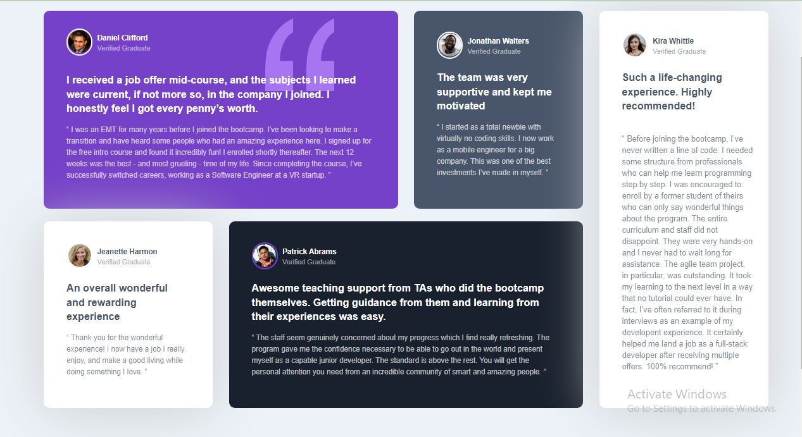

# Frontend Mentor - Testimonials grid section solution

This is a solution to the [Testimonials grid section challenge on Frontend Mentor](https://www.frontendmentor.io/challenges/testimonials-grid-section-Nnw6J7Un7). Frontend Mentor challenges help you improve your coding skills by building realistic projects. 

## Table of contents

- [Overview](#overview)
  - [The challenge](#the-challenge)
  - [Screenshot](#screenshot)
  - [Links](#links)
- [My process](#my-process)
  - [Built with](#built-with)
  - [What I learned](#what-i-learned)
  - [Continued development](#continued-development)
- [Author](#author)
- [Acknowledgments](#acknowledgments)


## Overview

### The challenge

Users should be able to:

- View the optimal layout for the site depending on their device's screen size

### Screenshot



### Links

- Solution URL: (https://github.com/Lilee52/TECHATHON-1.0/tree/main/testimonials-grid-section-main)
- Live Site URL: (https://lilee52.github.io/TECHATHON-1.0/testimonials-grid-section-main/)

## My process

### Built with

- Semantic HTML5 markup
- CSS custom properties
- Flexbox
- CSS Grid
- Mobile-first workflow
- [Styled Components](https://styled-components.com/) - For styles


### What I learned

I learnt how to make use of grid, I had initially had issues
 with the grid display for the larger screen

To see how you can add code snippets, see below:


```css
 .grid-container {
        display: grid;
        grid-template-areas: 
        "a a b c"
        "d e e c";
        width: 1250px;
        margin: 2em auto;
        gap: 10px;
        grid-template-columns: repeat(4, 315px);
        grid-template-rows: repeat(2, 368px);
    }

```


### Continued development

I will continue practicing grid layout to understand the use more.


## Author

- Frontend Mentor - [@Lilee52](https://www.frontendmentor.io/profile/yourusername)
- Twitter - [@imagine__lilies](https://www.twitter.com/yourusername)


## Acknowledgments
Special thanks to Techathon.
